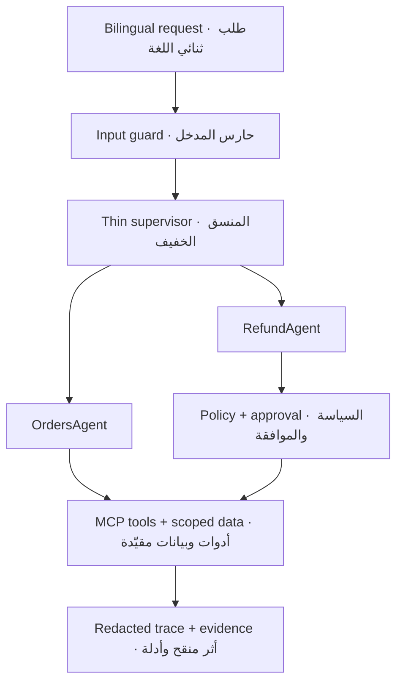

# Rafeeq Mini Labs · لابات رفيق المصغّر
## Implementation  · تطبيق

**Mona Alamri · منى العمري**

[SDAIA Academy on GitHub](https://github.com/SDAIAAcademy)

[](CHANGELOG.md)
[](https://almiyead-rgb.github.io/rafeeq-agentic-ai-labs/)
[](https://almiyead-rgb.github.io/rafeeq-agentic-ai-labs/compare.html)
[](https://colab.research.google.com/github/almiyead-rgb/rafeeq-agentic-ai-labs/blob/v0.9.0-rc3/notebooks/Rafeeq_Mini_Capstone.ipynb)
[](.env.example)

**Rafeeq Mini** is one cumulative, bilingual **guided-engineering mini-capstone** for the three-day course **Advanced Agentic AI Systems Engineering**. Learners build a safe delivery-support agent in small stages, test every stage, and export an auditable GitHub submission. It is a supervised engineering simulation—not a production deployment or an open-ended software assignment.

**رفيق المصغّر** مشروع **هندسة موجهة** تراكمي وثنائي اللغة لدورة **هندسة أنظمة الذكاء الاصطناعي التوكيلي المتقدمة** الممتدة ثلاثة أيام. يبني المتدرب مساعد دعم لعمليات التوصيل على مراحل صغيرة، ويختبر كل مرحلة، ثم يصدّر تسليمًا قابلًا للتدقيق على GitHub. وهو محاكاة هندسية تحت الإشراف، لا نشر إنتاجي ولا تكليف برمجي مفتوح النطاق.

> Release candidate `0.9.0-rc3`: automated repository, CI, and Pages checks are verified; the clean-account hosted-Colab acceptance remains manual. Start from the [bilingual learner portal](https://almiyead-rgb.github.io/rafeeq-agentic-ai-labs/). The mandatory path uses Google Colab Free CPU, `LLM_MODE=stub`, synthetic data, and no API key, GPU, terminal, PAT, or paid service.
>
> مرشح الإصدار `0.9.0-rc3`: اكتملت فحوص المستودع وCI وPages الآلية، وتبقى تجربة القبول البشرية في Colab بحساب نظيف. ابدأ من [بوابة المتدرب الثنائية اللغة](https://almiyead-rgb.github.io/rafeeq-agentic-ai-labs/). يعمل المسار الإلزامي على Colab المجاني وCPU، بالوضع `LLM_MODE=stub` وبيانات مصطنعة، بلا مفتاح API أو GPU أو طرفية أو PAT أو خدمة مدفوعة.

## Project scenario · سيناريو المشروع

A customer contacts the fictional delivery company **Tawseel** in Arabic or English to ask about an order or request a refund. Rafeeq detects the intent and order ID, verifies ownership through a scoped tool, retrieves only the active policy, delegates to the correct specialist, and records a redacted trace. Refunds require a delay greater than two days; amounts above SAR 500 pause for explicit human approval. Re-running a write remains safe through deterministic idempotency.

يتواصل عميل مع شركة التوصيل الافتراضية **توصيل** بالعربية أو الإنجليزية للسؤال عن طلب أو طلب استرداد. يحدد رفيق النية ورقم الطلب، ويتحقق من الملكية عبر أداة مقيّدة، ويسترجع السياسة السارية فقط، ويفوض المهمة للوكيل المتخصص، ويسجل أثرًا منقحًا. يشترط الاسترداد تأخرًا يزيد على يومين، وتتوقف المبالغ الأعلى من 500 ريال حتى تصدر موافقة بشرية صريحة. وتظل إعادة خلية الكتابة آمنة بفضل مفتاح منع التكرار الحتمي.



## Three-day build · البناء خلال ثلاثة أيام

| Day | Cells | Build outcome · ناتج البناء | Gate · البوابة |
|---|---:|---|---|
| 1 · Core & tools · النواة والأدوات | C0–C9 | Typed state, bounded graph, ReAct, schemas, and a real local MCP `stdio` connection · حالة محددة النوع، مخطط محدود، ReAct، مخططات أدوات، واتصال MCP محلي فعلي | `C9_DAY1_GATE` |
| 2 · Memory & orchestration · الذاكرة والتنسيق | C10–C20 | Session memory, scoped recall, policy retrieval, two specialists, typed delegation, planning, refund gate, and interrupt/resume · ذاكرة جلسية، استرجاع مقيّد، سياسات، وكيلان متخصصان، تفويض، تخطيط، بوابة استرداد، وتوقف/استئناف | `C20_DAY2_GATE` |
| 3 · Security & evidence · الأمن والأدلة | C21–C29 | Threat model, attack suite, guard repair, bounded reflection, traces, one measured optimization, scorecard, readiness, and safe export · نموذج تهديد، اختبارات هجوم، إصلاح الحواجز، انعكاس محدود، آثار، تحسين مقاس واحد، بطاقة نتائج، جاهزية، وتصدير آمن | `C29_EXPORT_SAFETY_CHECK` |

### Core and stretch · المسار الأساسي ومسار التوسع

| Path | Rule · القاعدة |
|---|---|
| **Core · أساسي** | The 14 learner TODOs, C0–C29 in order, the three gates, required reports/evidence, SDAIA administrative evidence, clean GitHub upload, and green Actions check are mandatory for assessment. · مهام المتدرب الـ14 وتشغيل C0–C29 بالترتيب والبوابات الثلاث والتقارير/الأدلة ومتطلبات سدايا الإدارية ورفع GitHub النظيف ونجاح Actions إلزامية للتقييم. |
| **Stretch · توسع** | Only extensions explicitly marked or announced by the instructor are optional. They never replace a failed core gate and do not disadvantage beginners who complete the core path. · الامتدادات التي تحددها أو تعلنها المدربة فقط اختيارية؛ لا تعوض بوابة أساسية فاشلة ولا تضر بالمبتدئ الذي يكمل المسار الأساسي. |

The notebook contains exactly 30 named sections and 14 short learner TODOs. The rest is runnable scaffolding, tests, hints, and evidence generation. Private answer keys, hidden evaluations, grades, and instructor checkpoints are intentionally absent.

يحتوي الدفتر على 30 قسمًا مسمى و14 مهمة قصيرة فقط للمتدرب. أما الباقي فهو بنية تشغيلية واختبارات وتلميحات وتوليد أدلة. لا يتضمن المستودع مفاتيح إجابة أو تقييمات خفية أو درجات أو نقاط استعادة للمدربة.

## Repository map · خريطة المستودع

| Path | Purpose · الغرض |
|---|---|
| `notebooks/` | Cumulative Colab notebook and cell map · الدفتر التراكمي وخريطة الخلايا |
| `src/rafeeq/` | Typed state, graph, agents, memory, retrieval, guards, tracing, assessment · النواة البرمجية |
| `mcp_server/` | Dependency-free educational MCP `stdio` server · خادم MCP تعليمي بلا اعتماديات |
| `data/public/` | Versioned synthetic learner datasets · بيانات مصطنعة عامة بإصدار محدد |
| `tests/public/` | Learner-visible contract and safety tests · اختبارات العقود والسلامة المرئية |
| `tests/schemas/` | JSON contracts for state, traces, assessment, and export · عقود JSON |
| `scripts/` | Doctor, gates, assessment, demo, validation, and safe export · أدوات التشغيل والتحقق |
| `reports/templates/` | Bilingual evidence and report templates · قوالب التقارير والأدلة |
| `reference-results/` | Versioned, result-only comparison contracts; no solution code · عقود مقارنة للنتائج فقط وذات إصدار؛ بلا كود حلول |
| `recovery/` | Restart and checkpoint guidance · إرشادات الاستعادة ونقاط الحفظ |
| `docs/` | Bilingual learner portal · بوابة المتدرب الثنائية |
| `docs/SDAIA_ADMIN_REQUIREMENTS.md` | Assessed administrative requirements and evidence · المتطلبات الإدارية المقيمة وأدلتها |
| `docs/LEARNING_PROGRESS_TEMPLATE.md` | Safe browser-only daily Git progress template · قالب تقدم Git يومي آمن من المتصفح |

## Local verification · التحقق المحلي

No installation is required for the core verification path:

```bash
python scripts/doctor.py
python -m unittest discover -s tests/public -p "test_*.py" -v
python scripts/validate_notebook.py
python scripts/run_assessment.py
python scripts/validate_release.py
```

لا يحتاج مسار التحقق الأساسي إلى تثبيت. جميع البيانات تعليمية مصطنعة، وجميع عمليات الاسترداد محاكاة لا تنفذ معاملة مالية.

## Safety boundary · حدود السلامة

- Never enter real customer or trainee data, credentials, private links, tokens, or API keys.
- Trusted identity and approval context are attached by the host runtime, never accepted as model-controlled tool arguments.
- Traces store decisions, counters, codes, and short rationale only—never raw prompts or private chain-of-thought.
- Read operations may receive one bounded retry for a transient failure; write operations are never retried automatically.
- Hidden tests, solutions, instructor notes, and real recovery checkpoints belong in a separate private repository—not a branch or tag here.

---

- لا تدخل بيانات حقيقية لعميل أو متدرب، أو بيانات دخول، أو روابط خاصة، أو رموزًا، أو مفاتيح API.
- يضيف المضيف هوية العميل وسياق الموافقة الموثوق، ولا تقبلهما الأدوات ضمن معاملات يسيطر عليها النموذج.
- تسجل الآثار القرارات والعدادات والرموز ومبررًا قصيرًا فقط، ولا تسجل الأمر الخام أو سلسلة التفكير الخاصة.
- قد تعاد عملية القراءة مرة واحدة فقط عند فشل عابر؛ ولا تعاد عملية الكتابة تلقائيًا.
- مكان الاختبارات الخفية والحلول وملاحظات المدربة ونقاط الاستعادة الحقيقية مستودع خاص منفصل، وليس فرعًا أو وسمًا هنا.


يُعرض رابط [أكاديمية سدايا على GitHub](https://github.com/SDAIAAcademy) بوصفه مرجعًا خارجيًا فقط. لا يستخدم المستودع شعارًا رسميًا ولا يدّعي اعتمادًا أو موافقة أو ملكية مؤسسية.

Educational simulation only · محاكاة تعليمية فقط. Learner reuse is governed by the limited [Course use permission](COURSE_USE_PERMISSION.md); it is not a broad open-source license. · يخضع استخدام المتدرب لـ[إذن استخدام مواد الدورة](COURSE_USE_PERMISSION.md) المحدود، وليس لترخيص مفتوح المصدر واسع.
